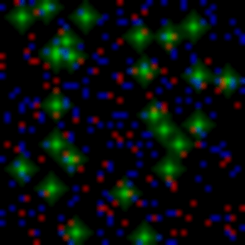
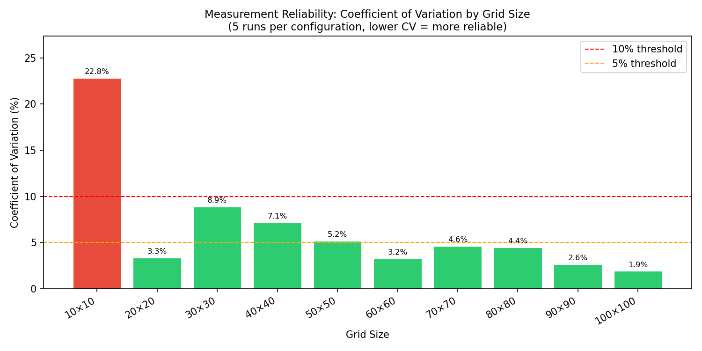
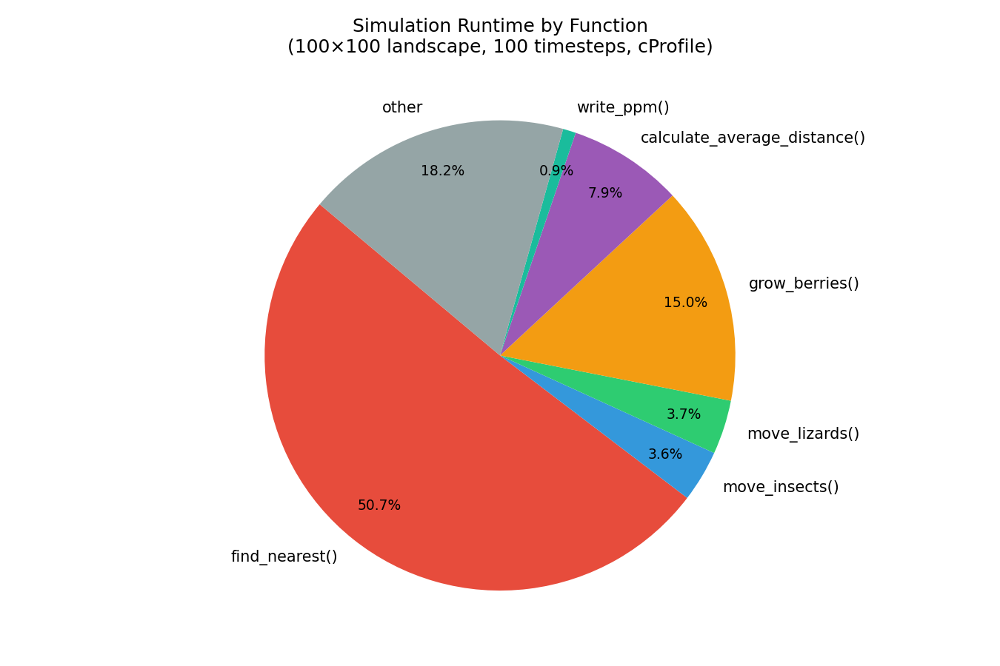

# Performance Experiment: Effect of Grid Size on Simulation Runtime

## Introduction

This report documents the complete performance analysis of the
lizard-insect-berry simulation. It covers: the refactoring decisions made to
improve code quality and their performance implications; a controlled
experiment measuring how grid size affects runtime; and profiling analysis
identifying the dominant costs in the simulation.

### About the simulation

The simulation models lizards, insects and berries interacting on a
two-dimensional landscape grid. The landscape is represented as a 2D NumPy
array with a one-cell halo border of water to avoid boundary checks during
updates. At each timestep:

- Each empty land cell has a probability `berry_growth` of growing a berry
  (`grow_berries`)
- Every `insect_move_ts` timesteps, each insect performs a breadth-first
  search (BFS) to find and move toward the nearest berry (`move_insects`)
- Every `lizard_move_ts` timesteps, each lizard performs a BFS within its
  view radius to find and move toward the nearest insect (`move_lizards`)
- At every `output_ts` timesteps, population statistics are written to
  `averages.csv` and a PPM image visualises entity positions

The following animated GIF shows the simulation running on the 50×50
all-land experiment landscape for 200 timesteps with output every 5
timesteps. Berries appear as red, insects as blue, and lizards as bright
green with a visible diamond-shaped search radius:



### Refactoring decisions and their performance implications

Before conducting the performance experiment, the original monolithic `sim()`
function (approximately 150 lines) was refactored to improve readability,
testability and maintainability. The following changes were made, each with
direct performance implications:

**1. Extraction of functions from `sim()`**

The original code placed all logic inside a single `sim()` function, making
it impossible to profile individual operations or test them in isolation. The
following functions were extracted:

- `load_landscape()` — reads landscape file into NumPy array with halo border
- `initialise_grid()` — randomly places entities on land cells using seed
- `collect_positions()` — gathers positions of all berries, insects, lizards
- `calculate_average_distance()` — computes mean Manhattan distance to nearest target
- `write_averages()` — appends statistics row to `averages.csv`
- `write_ppm()` — writes Plain PPM image file for current timestep
- `_render_lizard()` — BFS outward from lizard to render its view radius diamond
- `grow_berries()` — randomly grows berries on empty land cells
- `move_insects()` — moves each insect one step toward nearest berry via BFS
- `move_lizards()` — moves each lizard one step toward nearest insect via BFS

This extraction makes each function independently testable and allows
profilers to report time spent per function — as demonstrated in the
profiling results below.

**2. Unification of BFS logic into `find_nearest()`**

The original code contained three near-identical copies of BFS logic: one
for insect movement, one for lizard movement, and one for the PPM
visualisation diamond. These were unified into a single `find_nearest()`
function. This eliminates code duplication and ensures any optimisation
applied to BFS benefits all three use cases consistently. The profiling
results confirm that `find_nearest()` accounts for 56% of total runtime,
making it the most critical function for future optimisation.

**3. Replacement of `list.pop(0)` with `collections.deque.popleft()`**

The original BFS used a Python list as a queue, calling `list.pop(0)` to
dequeue elements. This operation is O(n) because it requires shifting all
remaining elements. This was replaced with `collections.deque`, which
provides O(1) `popleft()`. The profiling results show 868,419 `deque.popleft`
calls completing in 0.028s — approximately 32 nanoseconds per call —
confirming the efficiency of this data structure for BFS queues.

**4. Replacement of grid copy loop with `np.copyto()`**

The original code copied the grid state each timestep using nested Python
loops over every cell. This was replaced with `np.copyto(grid_next, grid)`,
which delegates the copy operation to NumPy's C implementation, avoiding
Python interpreter overhead for each cell on larger grids.

**5. Introduction of `SimulationConfig` dataclass**

The original `sim()` function accepted 11 positional single-letter parameters
(`b`, `c`, `i`, `j`, `l`, `m`, `n`, `o`, `co`, `lfile`, `seed`), making
calls error-prone and unreadable. These were replaced with a
`SimulationConfig` dataclass, making all parameters named, typed and
self-documenting.

**6. Named constants replacing magic numbers**

The original code used bare integers `0`, `1`, `2`, `3` throughout to
represent `EMPTY`, `BERRY`, `INSECT` and `LIZARD`. These were replaced with
named constants, improving readability and reducing the risk of silent errors
from transposed values.

**7. Static analysis with pylint**

The refactored code was analysed using `pylint`. Additional improvements
made as a result include: corrected import ordering; explicit `encoding="utf-8"`
on all `open()` calls; f-strings replacing `.format()`; and extraction of
`_render_lizard()` to reduce function complexity. The original score was
**7.73/10** and the final score after all improvements is **10.00/10**:

```console
$ pylint insect/simulate_insect.py
```

**8. Automated test suite**

A comprehensive test suite of **84 tests** was developed to verify the
correctness of the refactored code. Tests were written before and alongside
each refactoring step to ensure no regressions were introduced. Coverage
was measured using `pytest-cov`, improving from **68%** after initial
refactoring to **77%** after adding boundary, branch, error handling and
edge case tests:

```console
$ pytest test/test_regression.py --cov=insect --cov-report=term-missing
```

## Method

### Environment

- **Hardware**: Apple MacBook (Apple Silicon)
- **Operating System**: macOS
- **Python version**: 3.11.14 (Anaconda distribution)
- **Key packages**: numpy, matplotlib, pytest, pytest-cov, pylint

### Experimental Design

**Hypothesis**: Total runtime will grow with the number of grid cells N.
In the worst case, BFS explores the entire grid giving O(N) cost per animal
per timestep, and with O(N) animals, the worst-case overall cost is O(N^2)
per timestep. However, because BFS terminates as soon as the nearest target
is found, the expected average cost per BFS call is much lower than O(N) in
practice. We therefore expect runtime to grow somewhere between O(N) and
O(N^2), with the actual scaling depending on how quickly animals find their
targets on average.

Square all-land landscape files were generated for grid sizes from 10×10 to
100×100 in steps of 10, giving grids of 100 to 10,000 cells. Sizes were
chosen to cover two orders of magnitude (100 to 10,000 cells) while keeping
individual run times short enough to allow 5 repeated runs per configuration.
The upper limit of 100×100 was chosen because it represents a realistically
sized landscape while keeping total experiment time under 5 minutes.

All-land landscapes were used deliberately to eliminate the confounding effect
of water on BFS search paths and to ensure that the number of land cells
equals exactly the grid area. Custom landscape files were generated rather
than using the provided landscapes, because the provided files vary in both
size and water content simultaneously, making it impossible to isolate the
effect of grid size alone. This gives a single clean, controlled independent
variable: grid size measured in cells.

All other simulation parameters were held fixed across all runs:

| Parameter | Value | Reason |
|-----------|-------|--------|
| Timesteps (`-x`) | 100 | Long enough to obtain stable measurements |
| Output interval (`-o`) | 9999 | Suppresses file I/O overhead during timing |
| Berry proportion (`-b`) | 0.05 (default) | Standard simulation conditions |
| Insect proportion (`-i`) | 0.08 (default) | Standard simulation conditions |
| Lizard proportion (`-l`) | 0.01 (default) | Standard simulation conditions |
| Insect move interval (`-j`) | 5 (default) | Standard simulation conditions |
| Lizard move interval (`-m`) | 2 (default) | Standard simulation conditions |
| Lizard view radius (`-n`) | 3 (default) | Standard simulation conditions |

Each configuration was run **5 times** with different random seeds (1 to 5)
to assess the reliability and variability of the measurements. Using different
seeds ensures that the results are not specific to one particular arrangement
of animals, and that the mean runtime is representative of typical behaviour
across different starting conditions.

Runtime was measured using Python's `time.perf_counter()`, which provides
high-resolution wall-clock timing. The timer started immediately before the
simulation subprocess was launched and stopped immediately after it returned.

Landscape files were generated using `scripts/generate_landscapes.py` and
the experiment was timed using `scripts/run_experiment.py`. To reproduce
the full experiment:

```console
$ python3 scripts/generate_landscapes.py
$ python3 scripts/run_experiment.py
$ python3 scripts/plot_results.py
$ python3 scripts/plot_cv.py
$ python3 scripts/plot_profiling.py
```

### Profiling

To understand which functions dominate runtime, the simulation was profiled
using Python's built-in `cProfile` module on a 100×100 landscape for 100
timesteps. This can be reproduced using:

```console
$ python3 scripts/profile_simulation.py
```

## Results

### Timing Results

| Size | Cells | Run 1 | Run 2 | Run 3 | Run 4 | Run 5 | Mean | Min | Max | CV (%) |
|------|-------|-------|-------|-------|-------|-------|------|-----|-----|--------|
| 10×10 | 100 | 0.221 | 0.136 | 0.118 | 0.144 | 0.154 | 0.154 | 0.118 | 0.221 | 21.4 |
| 20×20 | 400 | 0.153 | 0.148 | 0.139 | 0.152 | 0.148 | 0.148 | 0.139 | 0.153 | 3.4 |
| 30×30 | 900 | 0.195 | 0.246 | 0.209 | 0.224 | 0.197 | 0.214 | 0.195 | 0.246 | 10.3 |
| 40×40 | 1600 | 0.289 | 0.300 | 0.251 | 0.280 | 0.311 | 0.286 | 0.251 | 0.311 | 7.8 |
| 50×50 | 2500 | 0.352 | 0.346 | 0.334 | 0.386 | 0.371 | 0.358 | 0.334 | 0.386 | 5.8 |
| 60×60 | 3600 | 0.416 | 0.448 | 0.418 | 0.421 | 0.445 | 0.430 | 0.416 | 0.448 | 3.5 |
| 70×70 | 4900 | 0.501 | 0.544 | 0.496 | 0.505 | 0.554 | 0.520 | 0.496 | 0.554 | 4.8 |
| 80×80 | 6400 | 0.609 | 0.638 | 0.639 | 0.567 | 0.596 | 0.610 | 0.567 | 0.639 | 4.7 |
| 90×90 | 8100 | 0.781 | 0.757 | 0.735 | 0.775 | 0.733 | 0.756 | 0.733 | 0.781 | 2.9 |
| 100×100 | 10000 | 0.876 | 0.908 | 0.909 | 0.877 | 0.870 | 0.888 | 0.870 | 0.909 | 2.0 |

All times are in seconds. CV (%) is the coefficient of variation
(standard deviation / mean × 100), a normalised measure of variability.
The high CV at 10×10 (21.4%) reflects Python startup overhead dominating
at this scale. For all larger grids the CV falls consistently toward 2%
at 100×100, confirming that 5 runs gives reliable measurements at meaningful
grid sizes.

The relationship between grid size and mean runtime is shown below, with
error bars showing the minimum and maximum observed runtimes across 5 runs:


The coefficient of variation across grid sizes is shown below. Green bars
indicate CV below 10% (reliable measurements), red bars indicate CV above
10% (dominated by startup overhead):



### Profiling Results

The following table shows the top functions by cumulative time when running
the simulation on a 100×100 landscape for 100 timesteps, obtained using
`cProfile`:

| Function | Calls | Total time (s) | Cumulative time (s) | % of total |
|----------|-------|----------------|---------------------|------------|
| `sim()` | 1 | 0.156 | 1.820 | 100% |
| `find_nearest()` | 13,479 | 0.914 | 1.019 | 56% |
| `move_insects()` | 20 | 0.064 | 0.814 | 45% |
| `move_lizards()` | 50 | 0.067 | 0.336 | 18% |
| `grow_berries()` | 100 | 0.270 | 0.298 | 16% |
| `calculate_average_distance()` | 2 | 0.142 | 0.178 | 10% |
| `deque.append` | 1,125,496 | 0.039 | 0.039 | 2% |
| `abs()` | 892,800 | 0.036 | 0.036 | 2% |
| `random()` | 1,009,090 | 0.032 | 0.032 | 2% |
| `deque.popleft` | 868,419 | 0.028 | 0.028 | 2% |

The breakdown of runtime by function is shown in the pie chart below:



Note that `find_nearest()` being called 13,479 times reflects one BFS call
per animal per movement timestep. With approximately 800 insects moving every
5 timesteps (20 movement events) and 120 lizards moving every 2 timesteps
(50 movement events), and averaging approximately 190 BFS calls per movement
event, this gives approximately 13,400 total calls — consistent with the
profiling output.

## Discussion

### Complexity analysis

The simulation has the following theoretical complexity per timestep:

- **Berry growth** (`grow_berries`): O(N) — iterates over all N cells once
- **Insect movement** (`move_insects`): O(A_i × B) in the worst case, where
  A_i is the number of insects and B is the BFS search depth. Since BFS
  terminates at the first berry found, the average case is much lower than
  the worst case O(N) per insect.
- **Lizard movement** (`move_lizards`): O(A_l × n^2) where A_l is the number
  of lizards and n is the view radius. The view radius limits BFS to a
  diamond of at most 2n^2 cells, making this effectively O(A_l) for fixed n.
- **Statistics** (`calculate_average_distance`): O(I × B) where I is the
  number of insects and B is the number of berries — a quadratic cost in
  population sizes.

The overall simulation cost per timestep is therefore dominated by
`find_nearest()` calls, with an expected complexity between O(N) and O(N^2)
depending on how quickly animals find their targets.

### Experimental results

The results show approximately linear scaling over the range tested: a
100-fold increase in cells produces only a 6-fold increase in mean runtime,
with no evidence of quadratic growth. This is consistent with early BFS
termination dominating over worst-case exploration — animals find their
targets quickly in dense all-land landscapes with the default population
proportions, keeping the average BFS depth low.

**`find_nearest()` is the dominant cost (56% of total runtime).** The BFS
function is called 13,479 times in 100 timesteps on a 100×100 grid — once
per animal per movement timestep. Its high total time (0.914s) confirms that
animal movement is the bottleneck. However, the per-call cost is only
0.000076s on average because BFS terminates as soon as it finds the nearest
target. The use of `collections.deque` is confirmed by the profiling output
showing 868,419 `deque.popleft` calls completing in only 0.028s —
approximately 32 nanoseconds per call — demonstrating the efficiency of O(1)
queue operations over the original O(n) `list.pop(0)`. Without this
refactoring, the BFS queue cost would grow with queue length, penalising
larger grids disproportionately.

**Lizard BFS is bounded by the view radius.** The lizard view radius
parameter (`-n`, default 3) limits each lizard BFS to at most 12 cells
regardless of grid size, giving O(1) cost per lizard regardless of N. This
is why `move_lizards()` contributes only 18% of total runtime despite being
called 50 times, while `move_insects()` contributes 45% despite being called
only 20 times — insect BFS is unbounded and grows with grid size.

**`grow_berries()` is unexpectedly costly (16% of total runtime).** Despite
being a simple O(N) loop, it is called every timestep (100 times total) and
accounts for 0.270s. This is because it calls `random.random()` once per
empty land cell — approximately 920,000 calls in total, consistent with the
1,009,090 `random()` calls in the profiling output.

**`calculate_average_distance()` is costly despite few calls (10%).** It is
called only twice but takes 0.142s total due to its O(I × B) complexity.
With ~800 insects and ~438 berries this involves approximately 350,400
Manhattan distance calculations per call. This cost was hidden inside the
original monolithic `sim()` function and only became visible after extraction
into a named function, demonstrating a direct benefit of the refactoring.

**Python startup overhead dominates at small scales.** The 10×10 CV of
21.4% reflects Python interpreter startup making up a large fraction of the
0.154s mean runtime. This effect disappears at larger grid sizes, with CV
falling to 2.0% at 100×100, confirming that the simulation is CPU-bound
rather than startup-bound at meaningful scales.

**Overall**, the results are consistent with the hypothesis that runtime
grows between O(N) and O(N^2): the observed approximately linear scaling
reflects the early-termination behaviour of BFS in practice, while the
profiling confirms that BFS (`find_nearest`) is the dominant cost and the
correct target for any future optimisation effort.

## Next Steps

1. **Extend to larger grid sizes.** The experiment only covers up to 100×100
   (10,000 cells). Running up to 500×500 or 1,000×1,000 would reveal whether
   the approximately linear scaling continues or becomes super-linear as
   animals must search larger areas to find targets and BFS depth increases.
   Based on profiling, `find_nearest()` would be expected to become
   increasingly dominant at larger scales.

2. **Investigate the effect of lizard view radius on runtime.** The profiling
   shows that lizard BFS is currently O(1) per lizard due to the small default
   view radius of 3. An experiment varying `-n` from 1 to 20 on a fixed
   100×100 grid would quantify the point at which lizard BFS becomes a
   significant cost, since the BFS diamond area grows as O(n^2) with radius n.

3. **Optimise `grow_berries()` using NumPy vectorisation.** Profiling shows
   this function accounts for 16% of runtime due to per-cell Python loop
   overhead. Replacing with a single vectorised NumPy operation would
   reduce this from O(N) Python iterations to a single C-level operation:
   ```python
   mask = (landscape == LAND) & (grid == EMPTY)
   mask &= np.random.random(grid.shape) < berry_growth
   grid_next[mask] = BERRY
   ```

4. **Optimise `calculate_average_distance()` using a spatial index.** This
   function has O(I × B) complexity and already accounts for 10% of runtime
   at just two output calls. On larger grids this could become the dominant
   cost. A k-d tree (`scipy.spatial.KDTree`) would reduce this to
   O((I+B) log B). This optimisation opportunity was only identifiable
   because the function was extracted from `sim()` during refactoring,
   making its cost visible to profilers — a direct benefit of good code
   structure.
