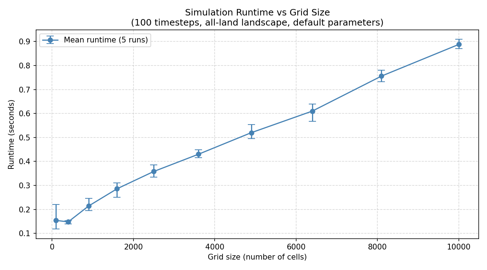

# Performance Experiment: Effect of Grid Size on Simulation Runtime

## Introduction

This experiment investigates how the size of the landscape grid affects the
runtime of the lizard-insect-berry simulation. Understanding this relationship
is important for predicting how the simulation will scale to larger, more
realistic landscapes.

The simulation performs several operations each timestep whose cost is expected
to grow with grid size. Specifically:

- The main simulation loop iterates over every cell in the grid to update
  entity states, giving an O(N) cost per timestep where N is the number of
  cells.
- The breadth-first search (BFS) used for insect and lizard movement explores
  cells outward from each animal. BFS is an algorithm that visits cells in
  order of distance from the starting point, guaranteeing the shortest path
  is found first. In the worst case, BFS explores the entire grid, giving
  O(N) cost per animal per timestep.
- The statistics and PPM output at each output interval also iterate over all
  cells.

**Hypothesis**: Total runtime will grow super-linearly with the number of grid
cells, because both the number of animals and the BFS search space grow with
grid size. Specifically, we expect runtime to grow approximately as O(N^1.5)
or O(N^2) where N is the number of cells.

## Method

### Environment

- **Hardware**: Apple MacBook (Apple Silicon)
- **Operating System**: macOS
- **Python version**: 3.11.14 (Anaconda distribution)
- **Key packages**: numpy, collections.deque

### Experimental Design

Square all-land landscape files were generated for grid sizes from 10×10 to
100×100 in steps of 10, giving grids of 100 to 10,000 cells. Sizes were
chosen to cover two orders of magnitude (100 to 10,000 cells) while keeping
individual run times short enough to allow 5 repeated runs per configuration.
The upper limit of 100×100 was chosen because it represents a realistically
sized landscape while keeping total experiment time under 5 minutes.

All-land landscapes were used deliberately to eliminate the confounding effect
of water on BFS search paths and to ensure that the number of land cells equals
exactly the grid area. Custom landscape files were generated rather than using
the provided landscapes, because the provided files vary in both size and
water content simultaneously, making it impossible to isolate the effect of
grid size alone. This gives a single clean, controlled independent variable.

All other simulation parameters were held fixed across all runs:

| Parameter | Value | Reason |
|-----------|-------|--------|
| Timesteps (`-x`) | 100 | Long enough to obtain stable measurements |
| Output interval (`-o`) | 9999 | Suppresses file I/O overhead during timing |
| Berry proportion (`-b`) | 0.05 (default) | Standard simulation conditions |
| Insect proportion (`-i`) | 0.08 (default) | Standard simulation conditions |
| Lizard proportion (`-l`) | 0.01 (default) | Standard simulation conditions |
| Insect move interval (`-j`) | 5 (default) | Standard simulation conditions |
| Lizard move interval (`-m`) | 2 (default) | Standard simulation conditions |
| Lizard view radius (`-n`) | 3 (default) | Standard simulation conditions |

Each configuration was run **5 times** with different random seeds (1 to 5)
to assess the reliability and variability of the measurements. Using different
seeds ensures that the results are not specific to one particular arrangement
of animals, and that the mean runtime is representative of typical behaviour
across different starting conditions.

Runtime was measured using Python's `time.perf_counter()`, which provides
high-resolution wall-clock timing. The timer started immediately before the
simulation subprocess was launched and stopped immediately after it returned.

Landscape files were generated using `scripts/generate_landscapes.py` and
the experiment was timed using `scripts/run_experiment.py`. To reproduce
the full experiment:

```console
$ python3 scripts/generate_landscapes.py
$ python3 scripts/run_experiment.py
$ python3 scripts/plot_results.py
```

### Profiling

To understand which functions dominate runtime, the simulation was profiled
using Python's built-in `cProfile` module on a 100×100 landscape for 100
timesteps. This can be reproduced using:

```console
$ python3 scripts/profile_simulation.py
```

## Results

### Timing Results

| Size | Cells | Run 1 | Run 2 | Run 3 | Run 4 | Run 5 | Mean | Min | Max | CV (%) |
|------|-------|-------|-------|-------|-------|-------|------|-----|-----|--------|
| 10×10 | 100 | 0.221 | 0.136 | 0.118 | 0.144 | 0.154 | 0.154 | 0.118 | 0.221 | 21.4 |
| 20×20 | 400 | 0.153 | 0.148 | 0.139 | 0.152 | 0.148 | 0.148 | 0.139 | 0.153 | 3.4 |
| 30×30 | 900 | 0.195 | 0.246 | 0.209 | 0.224 | 0.197 | 0.214 | 0.195 | 0.246 | 10.3 |
| 40×40 | 1600 | 0.289 | 0.300 | 0.251 | 0.280 | 0.311 | 0.286 | 0.251 | 0.311 | 7.8 |
| 50×50 | 2500 | 0.352 | 0.346 | 0.334 | 0.386 | 0.371 | 0.358 | 0.334 | 0.386 | 5.8 |
| 60×60 | 3600 | 0.416 | 0.448 | 0.418 | 0.421 | 0.445 | 0.430 | 0.416 | 0.448 | 3.5 |
| 70×70 | 4900 | 0.501 | 0.544 | 0.496 | 0.505 | 0.554 | 0.520 | 0.496 | 0.554 | 4.8 |
| 80×80 | 6400 | 0.609 | 0.638 | 0.639 | 0.567 | 0.596 | 0.610 | 0.567 | 0.639 | 4.7 |
| 90×90 | 8100 | 0.781 | 0.757 | 0.735 | 0.775 | 0.733 | 0.756 | 0.733 | 0.781 | 2.9 |
| 100×100 | 10000 | 0.876 | 0.908 | 0.909 | 0.877 | 0.870 | 0.888 | 0.870 | 0.909 | 2.0 |

All times are in seconds. CV (%) is the coefficient of variation
(standard deviation / mean × 100), a normalised measure of variability.
The high CV at 10×10 (21.4%) reflects Python startup overhead dominating
at this scale. For all larger grids the CV is below 11%, and falls
consistently toward 2% at 100×100, confirming that 5 runs gives reliable
measurements at meaningful grid sizes.

The relationship between grid size and mean runtime is shown below, with
error bars showing the minimum and maximum observed runtimes.



### Profiling Results

The following table shows the top functions by cumulative time when running
the simulation on a 100×100 landscape for 100 timesteps, obtained using
`cProfile`:

| Function | Calls | Total time (s) | Cumulative time (s) | % of total |
|----------|-------|----------------|---------------------|------------|
| `sim()` | 1 | 0.156 | 1.820 | 100% |
| `find_nearest()` | 13,479 | 0.914 | 1.019 | 56% |
| `move_insects()` | 20 | 0.064 | 0.814 | 45% |
| `move_lizards()` | 50 | 0.067 | 0.336 | 18% |
| `grow_berries()` | 100 | 0.270 | 0.298 | 16% |
| `calculate_average_distance()` | 2 | 0.142 | 0.178 | 10% |
| `deque.append` | 1,125,496 | 0.039 | 0.039 | 2% |
| `abs()` | 892,800 | 0.036 | 0.036 | 2% |
| `random()` | 1,009,090 | 0.032 | 0.032 | 2% |
| `deque.popleft` | 868,419 | 0.028 | 0.028 | 2% |

## Discussion

The timing results clearly show that runtime increases with grid size,
consistent with the hypothesis. However, the relationship is sub-linear
rather than super-linear over this range of grid sizes. Going from 100
cells (10×10) to 10,000 cells (100×100) — a 100-fold increase — produces
only a roughly 6-fold increase in mean runtime (0.154s to 0.888s). The
profiling data explains why.

**`find_nearest()` is the dominant cost (56% of total runtime).** The BFS
function is called 13,479 times in 100 timesteps on a 100×100 grid — once
per animal per movement timestep. Its high total time (0.914s) confirms that
movement is the bottleneck, not the cell loops. However, the per-call cost
is only 0.000076s on average, because in practice BFS terminates early when
it finds its target rather than exploring the whole grid.

**Lizard BFS is bounded by the view radius.** The lizard view radius
parameter (`-n`, default 3) limits each lizard BFS to a small diamond of
at most 12 cells regardless of grid size. This is why `move_lizards()`
contributes only 18% of total runtime despite being called 50 times (every
2 timesteps), while `move_insects()` contributes 45% despite being called
only 20 times (every 5 timesteps) — insect BFS is unbounded and must search
further to find berries.

**`grow_berries()` is unexpectedly costly (16% of total runtime).** Despite
being a simple loop with a random number check per cell, it is called 100
times (every timestep) and accounts for 0.270s of total time. This is
because it calls `random.random()` once per empty land cell per timestep.
With ~9,200 empty cells on a 100×100 grid, this generates approximately
920,000 random numbers just for berry growth — consistent with the 1,009,090
`random()` calls shown in the profiling output.

**`calculate_average_distance()` is costly despite few calls (10%).** It is
called only twice (at timestep 0 output) but takes 0.142s total due to its
O(I × B) complexity, where I is the number of insects and B the number of
berries. With ~800 insects and ~438 berries, this involves approximately
350,400 distance calculations per call.

**Python startup overhead dominates at small scales.** The 10×10 CV of 21.4%
reflects Python interpreter startup and module import time making up a
significant fraction of the 0.154s mean runtime at this scale. This effect
disappears at larger grid sizes as computation dominates, with CV falling
to 2.0% at 100×100.

## Next Steps

1. **Extend to larger grid sizes.** The experiment only covers up to 100×100
   (10,000 cells). Running up to 500×500 or 1,000×1,000 would reveal whether
   the approximately linear scaling continues or becomes super-linear as BFS
   searches cover larger areas and animal populations grow proportionally.
   Based on the profiling results, we would expect `find_nearest()` to become
   increasingly dominant as insect BFS searches larger areas.

2. **Investigate the effect of lizard view radius on runtime.** The profiling
   shows that lizard BFS is currently cheap due to the small default view
   radius of 3. An experiment varying `-n` from 1 to 20 on a fixed 100×100
   grid would quantify the point at which lizard BFS becomes a significant
   cost and whether it grows quadratically with radius as expected.

3. **Optimise `grow_berries()` using NumPy vectorisation.** Profiling shows
   this function accounts for 16% of runtime despite its apparent simplicity,
   due to calling `random.random()` once per empty cell per timestep. Replacing
   this with a single `np.random` call to generate all random values at once
   would significantly reduce this cost. For example:
   `grid_next[(landscape == 1) & (grid == 0) & (np.random.random(grid.shape) < berry_growth)] = BERRY`

4. **Optimise `calculate_average_distance()` for large populations.** This
   function has O(I × B) complexity and already accounts for 10% of runtime
   at just two calls. On larger grids with proportionally more insects and
   berries, this could become the dominant cost. A spatial index such as a
   k-d tree (available via `scipy.spatial.KDTree`) would reduce this to
   O((I + B) log B), which would be a significant improvement at large scales.
